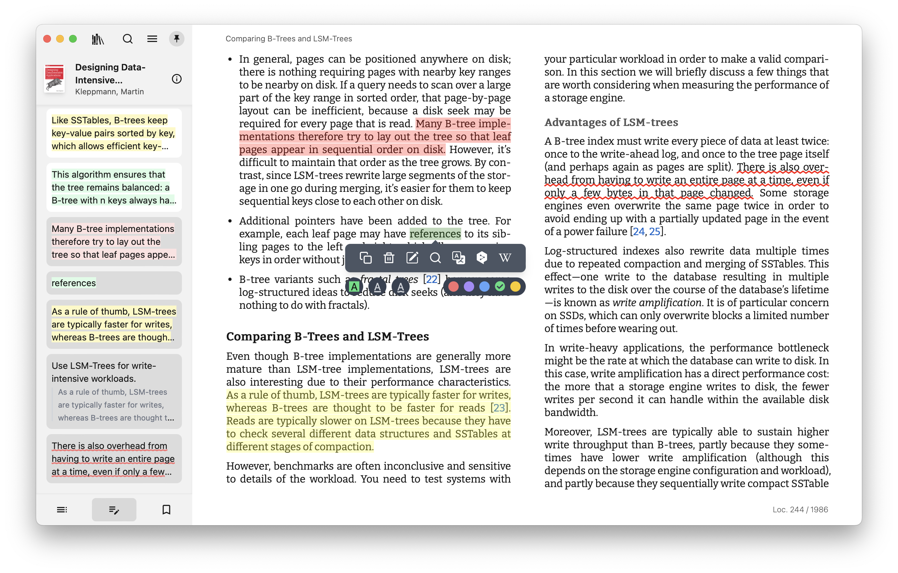
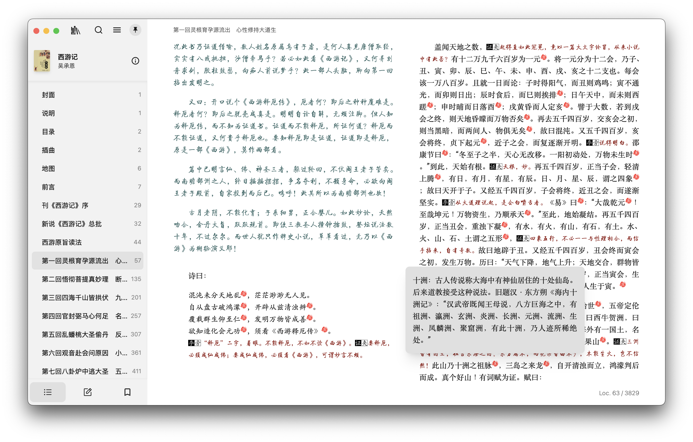
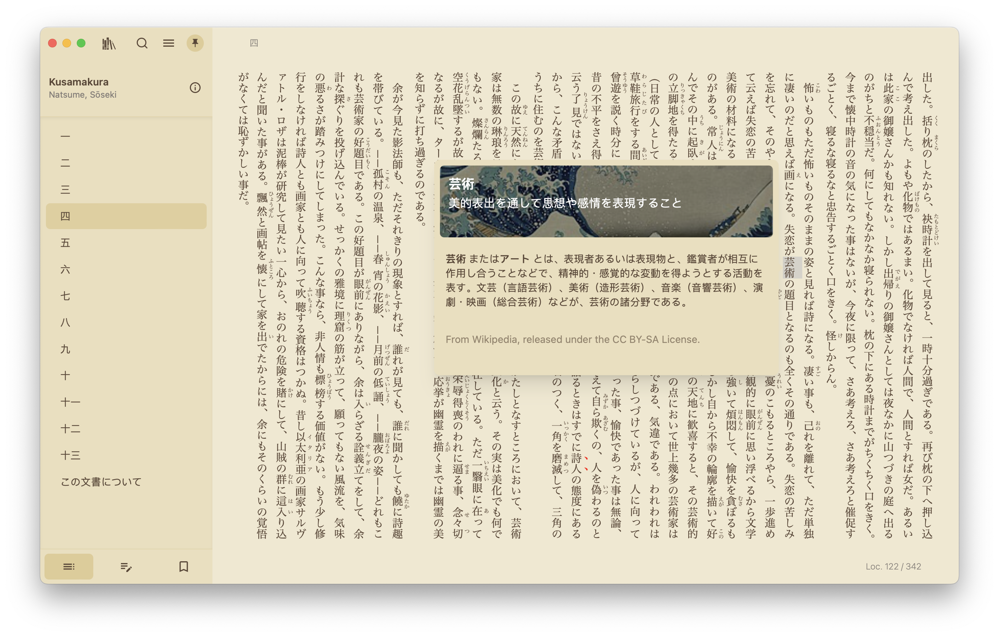
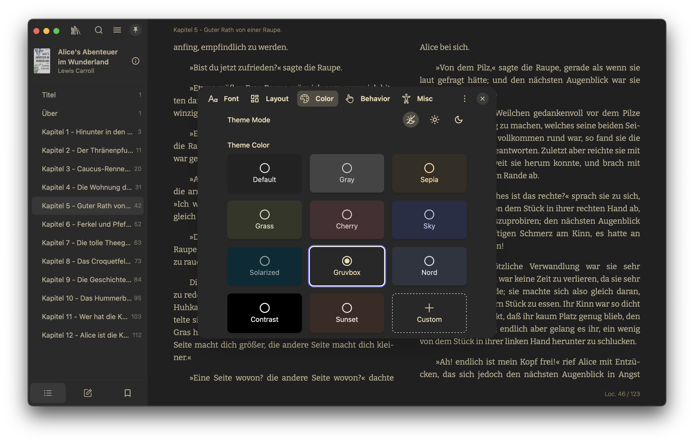

<div align="center">
  
  <h1>Wellread</h1>
  <br>

**Wellread** is a local-first ebook reader for deep reading on **macOS (Apple Silicon)**.
It is built with [Next.js 16](https://github.com/vercel/next.js) and [Tauri v2](https://github.com/tauri-apps/tauri),
on top of the [Foliate](https://github.com/johnfactotum/foliate) / [foliate-js](https://github.com/johnfactotum/foliate-js)
lineage, and adds an on-device **Reading Assistant** via an embedded eve sidecar.

[![OS][badge-platforms]][link-gh-releases]
[![AGPL Licence][badge-license]](LICENSE)
[![Language Coverage][badge-language-coverage]][link-locales]
[![Latest release][badge-release]][link-gh-releases]
[![Last commit][badge-last-commit]][link-gh-commits]

</div>

<p align="center">
  <a href="#features">Features</a> ·
  <a href="#downloads">Downloads</a> ·
  <a href="#documentation">Documentation</a> ·
  <a href="#building-from-source">Building from source</a> ·
  <a href="#upstream">Upstream</a> ·
  <a href="#license">License</a>
</p>

<div align="center">
  
</div>

## What Wellread is

| | |
| --- | --- |
| **Ships as** | macOS Apple Silicon app (`.dmg`) with in-app updater |
| **Data** | Local library on disk — no Wellread account, no hosted sync, no billing |
| **AI** | Optional Reading Assistant; your model endpoint + API key; loopback eve sidecar |
| **Not shipping** | Windows / Linux / Android / iOS / App Store / Flathub / hosted web app builds |

For a multi-platform cloud-capable reader, see [Upstream](#upstream).

## Features

| Feature | Description | Status |
| ------- | ----------- | ------ |
| Multi-format support | EPUB, MOBI, KF8 (AZW3), FB2, CBZ, TXT, PDF | ✅ |
| Scroll and page view modes | Switch between scrolling and paginated reading | ✅ |
| Full-text search | Search across the whole book | ✅ |
| Annotations and highlighting | Highlights, bookmarks, and notes | ✅ |
| Dictionary / Wikipedia lookup | Look up words and terms while you read | ✅ |
| Parallel read | Read two books or documents in a split view | ✅ |
| Customize font and layout | Font, layout, theme mode, and theme colors | ✅ |
| Code syntax highlighting | Colored code examples in software manuals | ✅ |
| File association and Open With | Open files in Wellread from Finder | ✅ |
| Library management | Organize, sort, and manage your ebook library | ✅ |
| OPDS / Calibre catalogs | Browse online catalogs (optional network) | ✅ |
| Translation providers | Translate via configured providers (e.g. DeepL, Yandex) | ✅ |
| Reading Assistant | Book-aware chat through the local eve sidecar | ✅ |
| Accessibility | Keyboard navigation and VoiceOver-oriented flows | ✅ |
| Visual and focus aids | Reading ruler, paragraph mode, and speed reading | ✅ |

## Downloads

Install from [GitHub Releases][link-gh-releases] (Apple Silicon).

- **Installer:** `Wellread_*_aarch64.dmg`
- **In-app updater:** `latest.json` + `Wellread_*_aarch64.app.tar.gz`

Unsigned builds may be blocked by Gatekeeper on first open: right-click the app → **Open**.

## Documentation

| Doc | Purpose |
| --- | --- |
| [`CONTEXT.md`](./CONTEXT.md) | Domain glossary (Reading Assistant, Books, Skill, …) |
| [`apps/readest-app/docs/architecture.md`](./apps/readest-app/docs/architecture.md) | Process boundaries, eve sidecar, local-first constraints |
| [`apps/readest-app/docs/reading-assistant-contract.md`](./apps/readest-app/docs/reading-assistant-contract.md) | Extract / tools / reading_context / skill contract |
| [`apps/readest-app/docs/code-layout.md`](./apps/readest-app/docs/code-layout.md) | Directory map |
| [`apps/readest-app/AGENTS.md`](./apps/readest-app/AGENTS.md) | Dev commands and agent rules |
| [`apps/eve-sidecar/AGENTS.md`](./apps/eve-sidecar/AGENTS.md) | Sidecar invariants and touch points |
| [`CONTRIBUTING.md`](./CONTRIBUTING.md) | Build prerequisites and contribution flow |
| [Project wiki][link-gh-wiki] | Extra notes |

## Building from source

```bash
git clone https://github.com/lima1217/wellread.git
cd wellread
git submodule update --init --recursive
pnpm install
pnpm --filter @wellread/wellread-app setup-vendors

# Desktop (macOS) — builds eve-sidecar first
pnpm tauri dev

# Production Apple Silicon bundle
pnpm build-macos-aarch64
```

`pnpm dev-web` starts the Next.js UI without compiling Tauri. It is a **development aid**, not a Wellread product download.

Full setup notes: [CONTRIBUTING.md](./CONTRIBUTING.md#getting-started).

## Screenshots








## Upstream

Wellread forked from the [Readest](https://github.com/readest/readest) codebase and still shares a lot of reader DNA (Foliate engine, library UX, annotations).

Readest remains the upstream project for:

- multi-platform builds (Windows, Linux, Android, iOS, web)
- cloud sync / accounts / store distribution

Wellread’s product direction is deliberately narrower: **local macOS + on-device assistant**.

## License

Wellread is free software under the [GNU Affero General Public License](https://www.gnu.org/licenses/agpl-3.0.html) v3 or later. See [LICENSE](LICENSE).

Libraries and frameworks used in this software:

- [foliate-js](https://github.com/johnfactotum/foliate-js) (MIT)
- [zip.js](https://github.com/gildas-lormeau/zip.js) (BSD-3-Clause)
- [fflate](https://github.com/101arrowz/fflate) (MIT)
- [PDF.js](https://github.com/mozilla/pdf.js) (Apache License 2.0)
- [daisyUI](https://github.com/saadeghi/daisyui) (MIT)
- [marked](https://github.com/markedjs/marked) (MIT)
- [next.js](https://github.com/vercel/next.js) (MIT)
- [react-icons](https://github.com/react-icons/react-icons) (various open-source licenses)
- [react](https://github.com/facebook/react) (MIT)
- [tauri](https://github.com/tauri-apps/tauri) (MIT)

Fonts bundled or loaded as web fonts:

[Bitter](https://fonts.google.com/specimen/Bitter), [Fira Code](https://fonts.google.com/specimen/Fira+Code), [Inter](https://fonts.google.com/specimen/Inter), [Literata](https://fonts.google.com/specimen/Literata), [Merriweather](https://fonts.google.com/specimen/Merriweather), [Noto Sans](https://fonts.google.com/specimen/Noto+Sans), [Roboto](https://fonts.google.com/specimen/Roboto), [LXGW WenKai](https://github.com/lxgw/LxgwWenKai), [MiSans](https://hyperos.mi.com/font/en/), [Source Han](https://github.com/adobe-fonts/source-han-sans/), [WenQuanYi Micro Hei](http://wenq.org/wqy2/)

Thanks to the [Web Chinese Fonts Plan](https://chinese-font.netlify.app) for open-source tools that make Chinese web fonts practical.

<div align="center" style="color: gray;">Happy reading with Wellread!</div>

[badge-license]: https://img.shields.io/badge/license-AGPL--3.0-teal
[badge-release]: https://img.shields.io/github/v/release/lima1217/wellread?color=green
[badge-platforms]: https://img.shields.io/badge/platform-macOS%20Apple%20Silicon-green
[badge-last-commit]: https://img.shields.io/github/last-commit/lima1217/wellread?color=blue
[badge-language-coverage]: https://img.shields.io/badge/locales-i18n-green
[link-gh-releases]: https://github.com/lima1217/wellread/releases
[link-gh-commits]: https://github.com/lima1217/wellread/commits/main
[link-gh-wiki]: https://github.com/lima1217/wellread/wiki
[link-locales]: https://github.com/lima1217/wellread/tree/main/apps/readest-app/public/locales
[link-readest]: https://github.com/readest/readest
