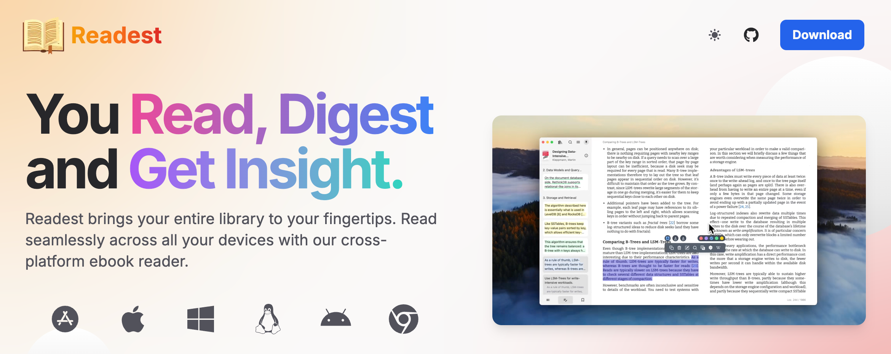
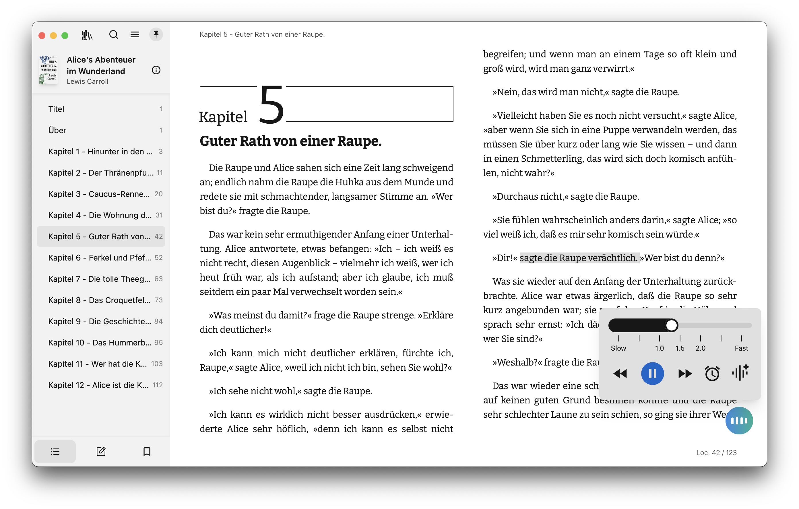
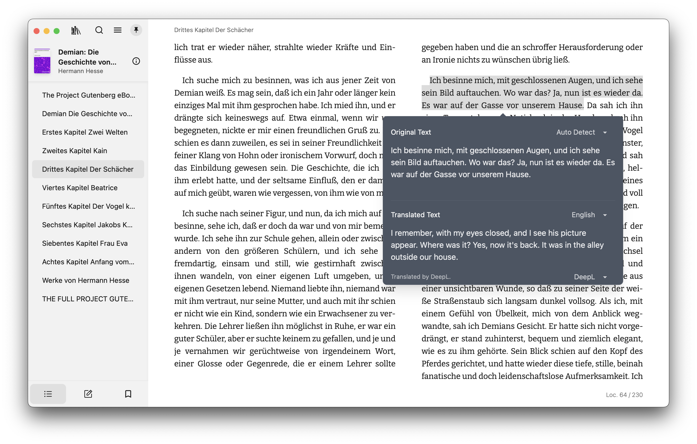

<div align="center">
  <a href="https://readest.com?utm_source=github&utm_medium=referral&utm_campaign=readme" target="_blank">
    
  </a>
  <h1>Wellread</h1>
  <br>

[Wellread][link-website] is an open-source ebook reader for immersive, deep reading. It is a modern rewrite of [Foliate](https://github.com/johnfactotum/foliate), built with [Next.js 16](https://github.com/vercel/next.js) and [Tauri v2](https://github.com/tauri-apps/tauri), and runs on macOS, Windows, Linux, Android, iOS, and the Web.

[![Website][badge-website]][link-website]
[![Web App][badge-web-app]][link-web-app]
[![OS][badge-platforms]][link-website]
<br>
[![Discord][badge-discord]][link-discord]
[![Reddit][badge-reddit]][link-reddit]
[![AGPL Licence][badge-license]](LICENSE)
[![Language Coverage][badge-language-coverage]][link-locales]
[![Donate][badge-donate]][link-donate]
[![Latest release][badge-release]][link-gh-releases]
[![Last commit][badge-last-commit]][link-gh-commits]
[![Commits][badge-commit-activity]][link-gh-pulse]
[![][badge-hellogithub]][link-hellogithub]
[![Ask DeepWiki][badge-deepwiki]][link-deepwiki]

</div>

<p align="center">
  <a href="#features">Features</a> ·
  <a href="#planned-features">Planned features</a> ·
  <a href="#screenshots">Screenshots</a> ·
  <a href="#downloads">Downloads</a> ·
  <a href="#documentation">Documentation</a> ·
  <a href="#getting-started">Getting started</a> ·
  <a href="#troubleshooting">Troubleshooting</a> ·
  <a href="#support">Support</a> ·
  <a href="#license">License</a>
</p>

<div align="center">
  <a href="https://readest.com" target="_blank">
    
  </a>
</div>

## Features

| Feature | Description | Status |
| ------- | ----------- | ------ |
| Multi-format support | EPUB, MOBI, KF8 (AZW3), FB2, CBZ, TXT, PDF | ✅ |
| Scroll and page view modes | Switch between scrolling and paginated reading | ✅ |
| Full-text search | Search across the whole book | ✅ |
| Annotations and highlighting | Highlights, bookmarks, and notes, including instant mode | ✅ |
| Dictionary / Wikipedia lookup | Look up words and terms while you read | ✅ |
| [Parallel read][link-parallel-read] | Read two books or documents in a split view | ✅ |
| Customize font and layout | Font, layout, theme mode, and theme colors | ✅ |
| Code syntax highlighting | Colored code examples in software manuals | ✅ |
| File association and Open With | Open files in Wellread from your file browser | ✅ |
| Library management | Organize, sort, and manage your ebook library | ✅ |
| OPDS / Calibre integration | Access online libraries and catalogs | ✅ |
| Translate with DeepL and Yandex | Translate a sentence or an entire book | ✅ |
| Text-to-speech (TTS) | Multilingual narration, including within a single book | ✅ |
| Sync across platforms | Sync book files, progress, notes, and bookmarks | ✅ |
| [Sync with Koreader][link-kosync-wiki] | Sync progress, notes, and bookmarks with [Koreader][link-koreader] | ✅ |
| Accessibility | Full keyboard navigation; VoiceOver, TalkBack, NVDA, and Orca | ✅ |
| Visual and focus aids | Reading ruler, paragraph mode, and speed reading | ✅ |

## Planned features

| Feature | Description | Priority |
| ------- | ----------- | -------- |
| AI-powered summarization | Summaries of books or chapters | 🛠 Building |
| Advanced reading stats | Reading time, pages read, and related metrics | 🛠 Building |
| Audiobook support | Play and manage audiobooks | 🔄 Planned |
| Handwriting annotations | Pen annotations on compatible devices | 🔄 Planned |
| In-library full-text search | Search topics and quotes across your library | 🔄 Planned |

Contributions and feature suggestions are welcome.

## Screenshots







## Downloads

### Mobile apps

<div align="center">
  <a href="https://apps.apple.com/app/id6738622779">
    </a>&nbsp;&nbsp;&nbsp;&nbsp;
  <a href="https://play.google.com/store/apps/details?id=com.bilingify.readest">
    </a>
</div>

### Platform-specific downloads

- macOS / iOS / iPadOS: install **Wellread** from the [App Store][link-appstore]. Beta builds are also on TestFlight (email your Apple ID to <readestapp@gmail.com>).
- Windows / Linux / Android: download from [readest.com][link-website] or [GitHub Releases][link-gh-releases].
- Linux: also available on [Flathub][link-flathub].
- Web: use [Wellread for Web][link-web-app].

## Documentation

Install and usage guides live in the official docs:

[https://readest.com/docs][link-docs]

## Building from source

To build Wellread from the latest commit, see [Getting started](./CONTRIBUTING.md#getting-started).

## Troubleshooting

### Wellread won’t launch on Windows (missing Edge WebView2 Runtime)

**Symptom**

- Double-clicking `Wellread.exe` does nothing: no window, and Task Manager does not show the process.
- This can affect both the installer and the portable build.

**Cause**

Microsoft Edge WebView2 Runtime is missing, outdated, or broken. Wellread needs WebView2 to render the UI on Windows.

**How to fix**

1. Open **Add or Remove Programs** and look for **Microsoft Edge WebView2 Runtime**.
2. Install or update WebView2 from [Microsoft’s WebView2 page](https://developer.microsoft.com/en-us/microsoft-edge/webview2?form=MA13LH). For offline installs, download the offline package and run it as Administrator.
3. Launch `Wellread.exe` again. If it still fails, reboot and retry.

**Additional tips**

- If one reinstall fails, uninstall Edge WebView2 completely, then reinstall it with Administrator privileges.
- Install the latest Windows updates from Microsoft.

**Still stuck?**

See [readest/readest#358](https://github.com/readest/readest/issues/358) for background, or ask on [Discord][link-discord] with environment details and the steps you already tried.

### AppImage shows a taskbar icon then exits

On some Arch Linux systems (especially Wayland), the Wellread AppImage may flash a taskbar icon and exit without opening a window.

You might see logs such as:

```text
Could not create default EGL display: EGL_BAD_PARAMETER. Aborting…
```

This usually comes from a mismatch between the AppImage’s bundled libraries and the system EGL / Wayland stack.

**Workaround 1: launch with `LD_PRELOAD` (recommended)**

```bash
LD_PRELOAD=/usr/lib/libwayland-client.so /path/to/Wellread.AppImage
```

**Workaround 2: use Flatpak**

Prefer the [Flathub package][link-flathub] when you want fewer host-library mismatches on Arch.

## Contributors

Wellread is open source. Open issues, suggest features, or send pull requests after you read the [contributing guidelines](CONTRIBUTING.md). Join [Discord][link-discord] for support or contribution help.

<a href="https://github.com/lima1217/wellread/graphs/contributors">
  <p align="left">
    
  </p>
</a>

## Support

If Wellread helps you, support development at [donate.readest.com](https://donate.readest.com). You’ll find GitHub Sponsors, card payments, and crypto. Donations fund bug fixes, performance work, and new features.

## License

Wellread is free software: you can redistribute it and/or modify it under the terms of the [GNU Affero General Public License](https://www.gnu.org/licenses/agpl-3.0.html) as published by the Free Software Foundation, either version 3 of the License, or (at your option) any later version. See the [LICENSE](LICENSE) file for details.

Libraries and frameworks used in this software:

- [foliate-js](https://github.com/johnfactotum/foliate-js) (MIT)
- [zip.js](https://github.com/gildas-lormeau/zip.js) (BSD-3-Clause)
- [fflate](https://github.com/101arrowz/fflate) (MIT)
- [PDF.js](https://github.com/mozilla/pdf.js) (Apache License 2.0)
- [daisyUI](https://github.com/saadeghi/daisyui) (MIT)
- [marked](https://github.com/markedjs/marked) (MIT)
- [next.js](https://github.com/vercel/next.js) (MIT)
- [react-icons](https://github.com/react-icons/react-icons) (various open-source licenses)
- [react](https://github.com/facebook/react) (MIT)
- [tauri](https://github.com/tauri-apps/tauri) (MIT)

Fonts bundled or loaded as web fonts:

[Bitter](https://fonts.google.com/specimen/Bitter), [Fira Code](https://fonts.google.com/specimen/Fira+Code), [Inter](https://fonts.google.com/specimen/Inter), [Literata](https://fonts.google.com/specimen/Literata), [Merriweather](https://fonts.google.com/specimen/Merriweather), [Noto Sans](https://fonts.google.com/specimen/Noto+Sans), [Roboto](https://fonts.google.com/specimen/Roboto), [LXGW WenKai](https://github.com/lxgw/LxgwWenKai), [MiSans](https://hyperos.mi.com/font/en/), [Source Han](https://github.com/adobe-fonts/source-han-sans/), [WenQuanYi Micro Hei](http://wenq.org/wqy2/)

Thanks to the [Web Chinese Fonts Plan](https://chinese-font.netlify.app) for open-source tools that make Chinese web fonts practical.

<div align="center" style="color: gray;">Happy reading with Wellread!</div>

[badge-website]: https://img.shields.io/badge/website-readest.com-orange
[badge-web-app]: https://img.shields.io/badge/read%20online-web.readest.com-orange
[badge-license]: https://img.shields.io/badge/license-AGPL--3.0-teal
[badge-release]: https://img.shields.io/github/v/release/lima1217/wellread?color=green
[badge-platforms]: https://img.shields.io/badge/platforms-macOS%2C%20Windows%2C%20Linux%2C%20Android%2C%20iOS%2C%20Web%2C%20PWA-green
[badge-last-commit]: https://img.shields.io/github/last-commit/lima1217/wellread?color=blue
[badge-commit-activity]: https://img.shields.io/github/commit-activity/m/lima1217/wellread?color=blue
[badge-discord]: https://img.shields.io/discord/1314226120886976544?color=5865F2&label=discord&labelColor=black&logo=discord&logoColor=white&style=flat-square
[badge-hellogithub]: https://abroad.hellogithub.com/v1/widgets/recommend.svg?rid=8a5b6ade2aee461a8bd94e59200682a7&claim_uid=eRLUbPOy2qZtDgw&theme=small
[badge-donate]: https://donate.readest.com/badge.svg
[badge-deepwiki]: https://deepwiki.com/badge.svg
[badge-reddit]: https://img.shields.io/reddit/subreddit-subscribers/readest?style=flat&logo=reddit&color=F37E41
[badge-language-coverage]: https://img.shields.io/badge/coverage-53%25%20population-green
[link-donate]: https://donate.readest.com/?tickers=btc%2Ceth%2Csol%2Cusdc
[link-appstore]: https://apps.apple.com/app/apple-store/id6738622779?pt=127463130&ct=github&mt=8
[link-website]: https://readest.com?utm_source=github&utm_medium=referral&utm_campaign=readme
[link-flathub]: https://flathub.org/en/apps/com.bilingify.readest
[link-web-app]: https://web.readest.com
[link-docs]: https://readest.com/docs
[link-gh-releases]: https://github.com/lima1217/wellread/releases
[link-gh-commits]: https://github.com/lima1217/wellread/commits/main
[link-gh-pulse]: https://github.com/lima1217/wellread/pulse
[link-gh-wiki]: https://github.com/lima1217/wellread/wiki
[link-discord]: https://discord.gg/gntyVNk3BJ
[link-parallel-read]: https://readest.com/#parallel-read
[link-koreader]: https://github.com/koreader/koreader
[link-hellogithub]: https://hellogithub.com/repository/8a5b6ade2aee461a8bd94e59200682a7
[link-deepwiki]: https://deepwiki.com/lima1217/wellread
[link-locales]: https://github.com/lima1217/wellread/tree/main/apps/readest-app/public/locales
[link-kosync-wiki]: https://github.com/lima1217/wellread/wiki/Sync-with-Koreader-devices
[link-reddit]: https://reddit.com/r/readest/
