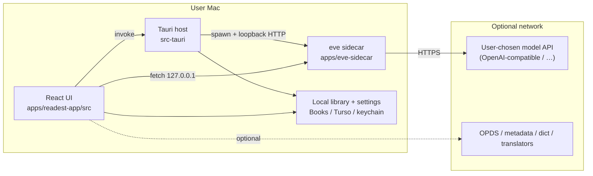
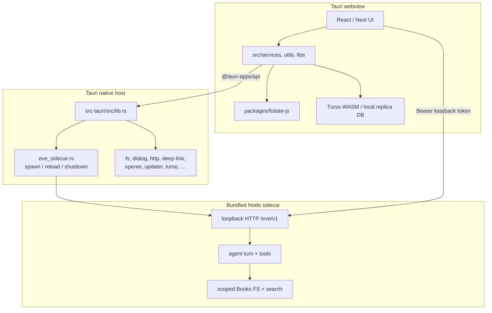
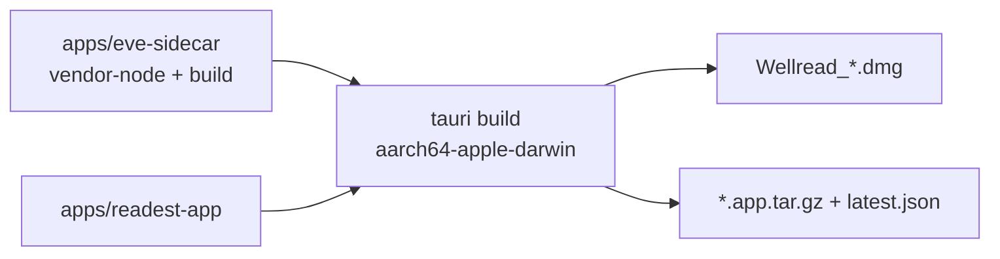

# Wellread architecture

This page maps how Wellread’s pieces fit together today: process boundaries,
hosts, and module responsibilities. Pair it with [`code-layout.md`](./code-layout.md)
when you need a file path.

Wellread is a **local-first** fork of the Readest / Foliate lineage. The shipped
product is a **macOS (Apple Silicon) Tauri app** with an embedded **eve sidecar**
for the Reading Assistant. There is no Wellread cloud account, no hosted sync,
and no billing stack.

Diagrams use [Mermaid](https://mermaid.js.org/) and render on GitHub.

## 1. High-level picture

Primary surface:

- **Desktop app** — `apps/readest-app` UI + `src-tauri` shell, packaged with
  `pnpm build-macos-aarch64` (`.dmg` + in-app updater tarball)

Supporting surfaces (not product downloads):

- **`pnpm dev-web` / `pnpm build-web`** — Next.js UI for local development and
  debugging without compiling Rust. Not a shipped Wellread web product.
- **Browser extension** — `apps/readest-app/extensions/send-to-readest` may still
  exist in-tree; it is not part of the macOS release contract.



What was removed from the Readest-era stack (do not reintroduce in docs or
designs without an explicit decision): Supabase auth, Stripe / IAP, S3 cloud
library, replica cloud sync APIs, Edge/native TTS product path, Cloudflare
`send-email` / IAP workers, and multi-platform release packaging.

## 2. Process boundaries

Three processes matter on macOS:



### 2.1 Eve sidecar

- Source: `apps/eve-sidecar`
- Bundled into the app via Tauri resources (`eve/.output`) and a platform Node
  binary under `src-tauri/binaries`
- Lifecycle owned by Rust (`src-tauri/src/eve_sidecar.rs`): process-global SSOT
  for listen URL + token; `ensure_eve_sidecar` (fingerprint skip-respawn) on
  cold start / new windows after keychain load; `reload_eve_sidecar` when the
  active model profile changes; `eve-sidecar-changed` broadcasts to webviews;
  shutdown on exit
- Frontend bridge: `src/services/wellread/eveSidecar.ts` +
  `ensureEveSidecar.ts` + `eveConnectionStore.ts` + `assistant/*`
- Security model: listen on loopback only, random bearer token, book tools
  sandboxed to the library Books tree

### 2.2 Runtime config

`/runtime-config.js` still exists, but it only exposes optional
`apiBaseUrl` for local/dev routing (`src/services/runtimeConfig.ts`). It is
**not** a Supabase / S3 / quota rebranding mechanism anymore.

## 3. Frontend architecture

Next.js 16 + React 19. App Router owns most pages; the historical Pages Router
reader entry (`src/pages/reader/[ids].tsx`) and `_document.tsx` remain for the
reader shell / COOP-COEP document wiring.

| Concern | Lives in |
|---|---|
| Library | `src/app/library` |
| Reader | `src/app/reader` (+ Pages Router entry) |
| OPDS browser | `src/app/opds` |
| Updater UI | `src/app/updater` |
| Thin API proxies | `src/app/api/{hardcover,metadata,opds}` |

There are **no** `app/auth`, `app/user`, or `app/send` product surfaces in the
current tree.

### 3.1 Reader cluster

`src/app/reader` is the largest UI area: Foliate rendering, annotations,
footnotes, translator overlays, RSVP, parallel view, settings panels, and the
Reading Assistant (`components/assistant/*` + `services/wellread/*`).

### 3.2 State (Zustand)

Single-purpose stores under `src/store`, including:

```
libraryStore / bookDataStore / readerStore / readerProgressStore
parallelViewStore / assistantPanelStore / settingsStore / themeStore
sidebarStore / trafficLightStore / appLockStore / deviceStore
proofreadStore / atmosphereStore / feedStore
customDictionaryStore / customFontStore / customTextureStore / customOPDSStore
```

Reading Assistant session/stream logic lives under
`src/services/wellread/assistant`, not a separate cloud AI store.

### 3.3 Book engine

Parsing and rendering sit on `packages/foliate-js`. PDF uses vendored
`pdfjs-dist`. Chinese conversion / segmentation use `simplecc-wasm` and
`jieba-wasm` under `public/vendor/*`.

## 4. Platform abstraction (`AppService`)

`src/services/appService.ts` is still the seam for filesystem, dialogs, open
external, directory scan, deep links, etc. Implementations:

- `nativeAppService.ts` — Tauri desktop (the shipped path)
- `webAppService.ts` — browser / `dev-web`
- `nodeAppService.ts` — Node tooling and tests

`environment.ts` picks the implementation from build target + runtime
detection. Database access mirrors the same split
(`nativeDatabaseService` / `webDatabaseService` / `nodeDatabaseService`).

## 5. Remaining HTTP routes

Cloud sync, storage, Stripe, IAP, TTS, and Send-inbox APIs are gone. What
remains under `src/app/api` are thin optional proxies:

```
hardcover/graphql   -> Hardcover GraphQL relay
metadata/search     -> Google Books / Open Library style lookup
opds/proxy          -> CORS-friendly OPDS proxy
```

Domain code for dictionaries, translators, OPDS, Readwise/Hardcover clients,
annotations, RSVP, and transformers still lives under `src/services/*` and
talks to the network **directly from the client** when the user enables those
features. There is no Wellread-operated backend for library bytes or accounts.

## 6. Cross-cutting subsystems (current)

### 6.1 Local library

Import and library management go through `ingestService`, `bookService`, and
`libraryService`. Books are stored on disk (hash copy under `Books/<hash>/` or
read-in-place). No cloud upload path.

### 6.2 Local replica helpers

`src/services/sync/{replicaBootstrap,replicaPersist,replicaRegistry,adapters}`
still help apply/persist local replica-shaped settings (fonts, dictionaries,
textures, OPDS catalogs, settings). This is **not** a hosted multi-device sync
product.

### 6.3 Reading Assistant (AI)

- UI: `src/app/reader/components/assistant`
- Client: `src/services/wellread/assistant` (`eveClient`, `eveFetch`,
  `useEveAgent`, session helpers)
- Config: multi `ModelProfile` + keychain-backed API keys
  (`modelConfig.ts`, `modelApiKey.ts`)
- Book context: extract / CFI chunking under `services/wellread/extract`
- Runtime: eve sidecar agent loop, tool rounds, scoped Books search
- Shared message conversion: `packages/eve-message` (`@wellread/eve-message`) —
  SessionMessage ↔ AI SDK UIMessage; sessions persist ordered `parts`
- Contract SSOT: [`reading-assistant-contract.md`](./reading-assistant-contract.md)
  (extract tree, tools, `<reading_context>`, skills)

**Protocol (breaking):** `POST /eve/v1/sessions/:id/turns` streams AI SDK
**UIMessage SSE** (`text/event-stream` via `pipeUIMessageStreamToResponse`),
not the former custom NDJSON (`application/x-ndjson` with `message.*` /
`tool.*` / `done` events). Clients must consume UIMessage chunks (plus
Wellread `data-eve-context-*` side events). There is no dual-write or
versioned path — bump the app and sidecar together.

### 6.4 Dictionaries, OPDS, translators, annotations, RSVP

Unchanged in role from the reader product: local packs + optional online
lookups; OPDS catalogs; translator providers; Foliate annotation model;
RSVP and content transformers. See the matching folders under `src/services`.

Article→EPUB conversion helpers may still live under `src/services/send/conversion`
for clip-style flows; there is no hosted Send inbox or email worker.

## 7. Native shell (`src-tauri`)

Focused Rust modules:

```
lib.rs           -> builder, commands, scopes, deep links
eve_sidecar.rs   -> sidecar lifecycle
epub_parser.rs / mobi_parser.rs / parser_common.rs
dir_scanner.rs / transfer_file.rs / clip_url.rs
macos/           -> menu and platform glue
```

Plugins (from vendored `packages/tauri-plugins` and in-tree plugins) cover fs,
dialog, http, opener, deep-link, updater, turso, and related host capabilities.
TTS / OAuth / IAP-oriented plugin usage is not part of the Wellread product
contract.

`allow_paths_in_scopes` in `lib.rs` still matters: frontend code may only widen
`fs` / asset scopes for paths the dialog (or persisted scope) already granted.

## 8. Build and release



- Dev: `pnpm tauri dev` (builds sidecar first via `beforeDevCommand`)
- Release: `pnpm build-macos-aarch64`
- Distribution: [GitHub Releases](https://github.com/lima1217/wellread/releases)
  (Apple Silicon installer + signed updater payload)

Windows / Linux / Android / iOS / App Store / Flathub / hosted web app are
**not** Wellread release targets. Upstream Readest remains the multi-platform
lineage if you need those.

## 9. Quick rule of thumb

1. **Reading Assistant / model I/O** → `services/wellread/*` + eve sidecar, never
   a Wellread cloud API.
2. **Filesystem / dialogs / updater / sidecar lifecycle** → `appService` /
   Tauri commands / `eve_sidecar.rs`.
3. **Book render / annotations / reader UI** → `src/app/reader`, Foliate,
   reader services.
4. **Optional catalogs / metadata / translation** → client-side services + the
   thin `src/app/api` proxies above.
5. **Library bytes** → local disk only.

If a design assumes accounts, quotas, hosted book storage, or cross-device
cloud sync, it describes upstream Readest history—not current Wellread.
